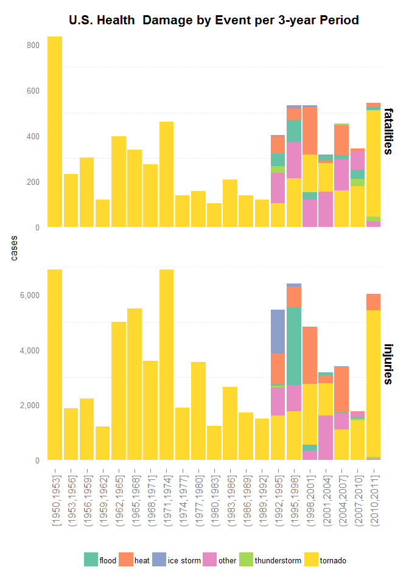
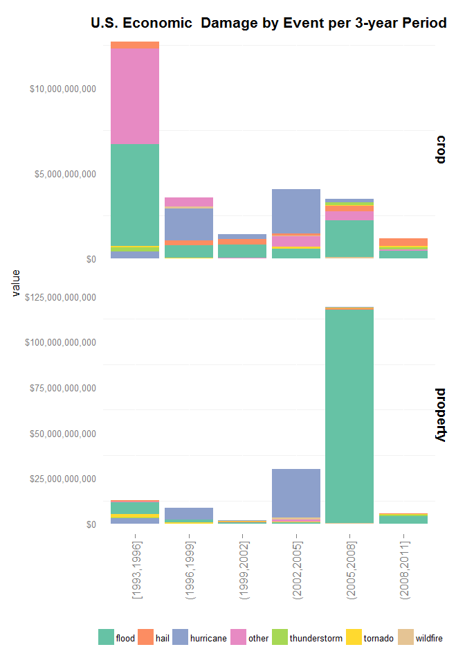
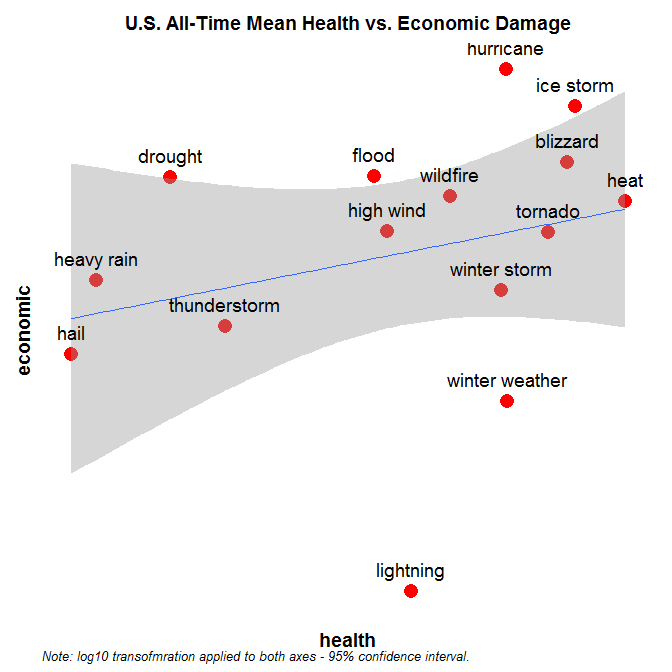

# StormData - Identifying the health & economical impact of severe weather events
Jamamel  
Thursday, November 20, 2014  

# Synopsis

The following analysis aims to assess the impact of sever weather events (e.g. tornadoes, floods) through recorded health & economic damaged observed in the U.S over from 1950 through 2011. The dataset used is the  U.S. National Oceanic and Atmospheric Administration's (NOAA) [storm database](https://d396qusza40orc.cloudfront.net/repdata%2Fdata%2FStormData.csv.bz2). Recorded fatality, injury,property & crop damage entries across the country are broken down to identify leading events responsible historically for these losses. We present the top types of events to which these damages are associated so that budget allocation in prevention and reaction in disaster management is better allocated.This analysis is meant for the sole purpose of visualizing said distributions and relationships. No models or explicit recommendations are produced, but will hopefully help identify areas where plausible hypothesis can more thouroughly investigated in future endeavours.

# Questions

We aim to address two specific questions, though other corollary analyses are also presented:

- Across the United States, which types of events are most harmful with respect to population health?
- Across the United States, which types of events have the greatest economic consequences?

# Data Processing

For information about the data model, design and analyses performed to produce the storm data used, please refer to:

- [National Weather Service Storm Data Documentation](https://d396qusza40orc.cloudfront.net/repdata%2Fpeer2_doc%2Fpd01016005curr.pdf)
- [National Climatic Data Center Storm Events FAQ](https://d396qusza40orc.cloudfront.net/repdata%2Fpeer2_doc%2FNCDC%20Storm%20Events-FAQ%20Page.pdf)

All required R packages are loaded and data downloaded from the mentioned url and loaded into R


```r
library(knitr)
library(data.table)
library(lubridate)
library(magrittr)
library(reshape2)
library(ggplot2)
library(grid)
library(scales)
library(gridExtra)
```


```
## 
## Attaching package: 'lubridate'
## 
## The following objects are masked from 'package:data.table':
## 
##     hour, mday, month, quarter, wday, week, yday, year
```


```r
# create folder to store downloaded data in chosen working directory
datadir <- paste(getwd(),'/data',sep = '')
suppressWarnings(dir.create(datadir))

# download data and store in data folder
zipdata <- paste(datadir,'/StormData.csv.bz2',sep = '')
# download.file('https://d396qusza40orc.cloudfront.net/repdata%2Fdata%2FStormData.csv.bz2',zipdata)


# unzip and load downloaded data ---------------------------------------------------------
# data will be uploaded and assigned to object "d" of class data.table
# data.table allows for data manipulation by reference, avoiding unnecessary copying and
# memory hoarding of large datasets (like the one in this analysis)


# read sample to determine column classes for full upload
d <- read.csv(bzfile(zipdata),nrows = 5000, header = T,stringsAsFactors = F)

cclass <- sapply(d,class)
cclass[c('BGN_TIME','END_TIME','F')] <- 'character'
cclass[cclass %in% 'logical'] <- 'character'

# read full dataset after classes have been identified
# recode all column names to lower case for ease of use and to match coding standards
d <- data.table(read.table(bzfile(zipdata),header = T, colClasses = cclass,sep = ',',na.strings = ''))
setnames(d, old = colnames(d), new = tolower(colnames(d)))
str(d,1)
```

```
## Classes 'data.table' and 'data.frame':	902297 obs. of  37 variables:
##  $ state__   : num  1 1 1 1 1 1 1 1 1 1 ...
##  $ bgn_date  : chr  "4/18/1950 0:00:00" "4/18/1950 0:00:00" "2/20/1951 0:00:00" "6/8/1951 0:00:00" ...
##  $ bgn_time  : chr  "0130" "0145" "1600" "0900" ...
##  $ time_zone : chr  "CST" "CST" "CST" "CST" ...
##  $ county    : num  97 3 57 89 43 77 9 123 125 57 ...
##  $ countyname: chr  "MOBILE" "BALDWIN" "FAYETTE" "MADISON" ...
##  $ state     : chr  "AL" "AL" "AL" "AL" ...
##  $ evtype    : chr  "TORNADO" "TORNADO" "TORNADO" "TORNADO" ...
##  $ bgn_range : num  0 0 0 0 0 0 0 0 0 0 ...
##  $ bgn_azi   : chr  NA NA NA NA ...
##  $ bgn_locati: chr  NA NA NA NA ...
##  $ end_date  : chr  NA NA NA NA ...
##  $ end_time  : chr  NA NA NA NA ...
##  $ county_end: num  0 0 0 0 0 0 0 0 0 0 ...
##  $ countyendn: chr  NA NA NA NA ...
##  $ end_range : num  0 0 0 0 0 0 0 0 0 0 ...
##  $ end_azi   : chr  NA NA NA NA ...
##  $ end_locati: chr  NA NA NA NA ...
##  $ length    : num  14 2 0.1 0 0 1.5 1.5 0 3.3 2.3 ...
##  $ width     : num  100 150 123 100 150 177 33 33 100 100 ...
##  $ f         : chr  "3" "2" "2" "2" ...
##  $ mag       : num  0 0 0 0 0 0 0 0 0 0 ...
##  $ fatalities: num  0 0 0 0 0 0 0 0 1 0 ...
##  $ injuries  : num  15 0 2 2 2 6 1 0 14 0 ...
##  $ propdmg   : num  25 2.5 25 2.5 2.5 2.5 2.5 2.5 25 25 ...
##  $ propdmgexp: chr  "K" "K" "K" "K" ...
##  $ cropdmg   : num  0 0 0 0 0 0 0 0 0 0 ...
##  $ cropdmgexp: chr  NA NA NA NA ...
##  $ wfo       : chr  NA NA NA NA ...
##  $ stateoffic: chr  NA NA NA NA ...
##  $ zonenames : chr  NA NA NA NA ...
##  $ latitude  : num  3040 3042 3340 3458 3412 ...
##  $ longitude : num  8812 8755 8742 8626 8642 ...
##  $ latitude_e: num  3051 0 0 0 0 ...
##  $ longitude_: num  8806 0 0 0 0 ...
##  $ remarks   : chr  NA NA NA NA ...
##  $ refnum    : num  1 2 3 4 5 6 7 8 9 10 ...
##  - attr(*, ".internal.selfref")=<externalptr>
```


We then transform beginning & end date & time variables to proper date formats.


```r
datecols <- c('bgn_date','end_date')
timecols <- c('end_date','end_time')

d[,eval(datecols) := lapply(.SD, as.IDate,format = '%m/%d/%Y'), .SDcols = datecols]
d[,eval(timecols) := lapply(.SD, as.ITime,format = "%H%M"), .SDcols = timecols]
setkey(d,refnum)
```


In order to translate property and crop damages to numerical values, we must create a look-up table for values *k, m,* & *b* (multipliers for thousands, millions, and billions).


```r
# we recode to NA crop damage multiplier codes with ambiguous interpretations
# (!cropdmgexp %in% c('k','m','b'))
d[,cropdmgexp := tolower(cropdmgexp)]
d[!cropdmgexp %in% c('k','m','b'),cropdmgexp := NA]


# we recode to NA property damage multiplier codes with ambiguous interpretations
# (!propdmgexp %in% c('k','m','b'))
d[,propdmgexp := tolower(propdmgexp)]
d[!propdmgexp %in% c('k','m','b'),propdmgexp := NA]


transtab <- list(list('m',1e+06),
                 list('k',1e+03),
                 list('b',1e+09)) %>%
  rbindlist

setnames(transtab, old = c('V1','V2'), new = c('code', 'value'))
setkey(transtab,code)
transtab
```


```
##    code value
## 1:    b 1e+09
## 2:    k 1e+03
## 3:    m 1e+06
```

We then translate these property and crop damage multiplier in our data into numerical values


```r
# translsate the crop damage multiplier to numerical by creating the variable numcropexp
# this is created by looking up the values of cropdmgexp in transtab
d[,numcropexp := transtab[cropdmgexp,'value', with = F]]

# calculate numeric crop damage (numcropexp * cropdmg)
d[,crop := (numcropexp * cropdmg)]

# translsate the property damage multiplier to numerical analogously to crop damage
d[,numpropexp := transtab[propdmgexp,'value', with = F]]

# calculate numeric property damage (numcropexp * cropdmg)
d[,property := (numpropexp * propdmg)]
```

```r
summary(d$crop)
```

```
##     Min.  1st Qu.   Median     Mean  3rd Qu.     Max.     NA's 
## 0.00e+00 0.00e+00 0.00e+00 1.73e+05 0.00e+00 5.00e+09   618440
```

```r
summary(d$property)
```

```
##     Min.  1st Qu.   Median     Mean  3rd Qu.     Max.     NA's 
## 0.00e+00 0.00e+00 1.00e+03 9.80e+05 1.00e+04 1.15e+11   466255
```


Once these numerical economic variables have been calculated, we write a function that will aggregate and plot economic and health damage separately.

The input parameters for this function are:

- **d**: loaded storm data.table
- **damagecols**: character vector with pairs of variables to include in each analysis (e.g. damagecols = c('health', 'fatalities') in health damage case)
- **damage**: character value with category of analysis (i.e. 'health' or 'economic')
- **yname**: character value for resulting *y-axis* label in plot
- **yfrmt**: character value for *y-axis* scale format in plot

The object returned by said function is a list with 3 elements to it:

- **dt**: resulting data.table after calculation of new metrics
- **viz**: ggplot2 barchart of selected damage analysis
- **coverage**: list containing descriptives of % of damage covered in analysis


```r
describeDmg <- function(d, damagecols, damage, yname, yfrmt){
  
  # we create a string to subset our data and extract only those weather events
  # positive damage (e.g. crop & property damage are > 0 in the economic damage case)
  subsform <- paste(damagecols[1], ' > 0 & ', damagecols[2],' > 0', sep = '')
  
  # create subset data.table with subset string created above
  dmgdt <- d[eval(parse(text = subsform))]
  dmgdt[,.N,by = evtype][order(-N),]
  
  # re-coding of events into "event" variable.
  # events are changed to lower case and some re-coding/cleaning is applied to clean up records.
  dmgdt[,event := tolower(evtype)]
  dmgdt[,.N,by = event][order(-N),]
  
  dmgdt[grepl('tornado',event),event := 'tornado']
  dmgdt[grepl('hurricane',event),event := 'hurricane']
  dmgdt[grepl('typhoon',event),event := 'hurricane']
  dmgdt[grepl('winter weather',event),event := 'winter weather']
  dmgdt[grepl('cold',event),event := 'winter weather']
  dmgdt[grepl('thunderstorm',event),event := 'thunderstorm']
  dmgdt[grepl('flood',event),event := 'flood']
  dmgdt[grepl('heat',event),event := 'heat']
  dmgdt[grepl('high wind',event),event := 'high wind']
  
  dmgdt[event %in% c('wild fires','wild/forest fire'),event := 'wildfire']
  dmgdt[event == 'rip currents',event := 'rip current']
  dmgdt[event %in% c('tstm wind'),event := 'thunderstorm']
  
  # in order to make visualization easier, damage by event per measure (i.e. 'fatalities' or 'injuries')
  # is aggregated and ranked. 
  # coverage of events recoded
  sumsform <- paste('list(sum(', damagecols[1], '), sum(', damagecols[2],'))', sep = '')
  x <- dmgdt[,eval(parse(text = sumsform)),by = event]
  x[,eval(parse(text = damage)) := V1 + V2]
  
  
  # for each damage measure (e.g. 'fatality' & 'injury' in health case) we identify the top ten 
  # event types in the ranked/ordered aggregation of total damage by event
  # coverage % of top ten events in total damage for variable 1
  
  coverage  <-  vector('list',4)
  names(coverage) <- c(damagecols, paste(damagecols,2011,sep = ''))
  
  y <- x[order(-V1),]; y
  coverage[[1]] <- sum(y$V1[1:10])/sum(y$V1)
  
  # coverage % of top ten events in total damage for variable 2
  y <- x[order(-V2),]
  coverage[[2]] <- sum(y$V2[1:10])/sum(y$V2)
  
  # no events with fatalities or injuries have missing beginning date (bgn_date)
  dmgdt[is.na(bgn_date),.N]
  
  # create year variable from beginning date of each event (for binning purposes in plot)
  library(lubridate)
  dmgdt[,year := year(bgn_date)]
  
  
  # we perform analogous analysis by damage variable focusing on years 2010 & 2011
  x2 <- dmgdt[year %in% 2010:2011,eval(parse(text = sumsform)),by = event]
  x2 <- x2[,damage := V1 + V2][order(-damage),]
  
  # coverage % fatalities
  y2 <- x2[order(-V1),]; y2
  coverage[[3]] <- sum(y2$V1[1:10])/sum(y2$V1)
  
  # coverage % injuries
  y2 <- x2[order(-V2),]
  coverage[[4]] <- sum(y2$V2[1:10])/sum(y2$V2)
  
  dmgcol1 <- paste('sum(',damagecols[1],')',sep = '')
  dmgcol2 <- paste('sum(',damagecols[2],')',sep = '')
  
  # create tidy dataset (tidyhd0) by subsetting dmgdt across observations relevant to top ten events
  # then rbind and identify unique observations
  tidyhd1 <- dmgdt[event %in% dmgdt[,eval(parse(text = dmgcol1)),by = event][order(-V1),][1:10,event],]
  tidyhd2 <- dmgdt[event %in% dmgdt[,eval(parse(text = dmgcol2)),by = event][order(-V1),][1:10,event],]
  tidyhd0 <- unique(rbind(tidyhd1,tidyhd2))
  setkey(tidyhd0,refnum)
  
  # we melt our tidy dataset to obtain a better data structure for plotting
  tidyhd <- melt(tidyhd0,id.vars = c('refnum','event','bgn_date','year'),measure.vars = damagecols)
  
  # aggregate damage across variables per year for plotting
  plothd <- tidyhd[,sum(value), by = c('variable','event','year')]
  setnames(plothd,'V1','frequency')
  
  # for better plotting purposes, bin years into 3-year periods and add bin to plothd
  year <- plothd$year
  
  br <- seq(from = min(year),to = min(year) + floor(diff(range(year))/3)*3 + 3, by = 3)
  br[length(br)] <- max(year)
  br <- unique(br)
  plothd[,year3 := cut(year, br, include.lowest = T)]
  
  # Identify top 4 events for each event and recode rest of top 10 to 'other'
  plothd[!event %in% union(y$event[1:4], y2$event[1:4]),event := 'other']
  
  plothd <- plothd[,sum(frequency), by = c('variable','event','year3')]
  setnames(plothd,'V1','frequency')
  
  
  # plot fatality and injurie timelines, and bars with historics
  capwords <- function(s, strict = FALSE) {
    cap <- function(s) paste(toupper(substring(s, 1, 1)),
                             {s <- substring(s, 2); if(strict) tolower(s) else s},
                             sep = "", collapse = " " )
    sapply(strsplit(s, split = " "), cap, USE.NAMES = !is.null(names(s)))
    }
  
  # create damage barchart
  title <- paste('U.S.',capwords(damage), ' Damage by Event per 3-year Period')
  p <- ggplot(plothd,aes(x = year3,y = frequency,group = event, fill = event)) +
    geom_bar(stat = 'identity') +
    ggtitle(title) +
    facet_grid(variable ~ ., scales = "free_y") +
    scale_fill_brewer(palette = 'Set2') +
    scale_x_discrete(name = "") +
    scale_y_continuous(labels = eval(parse(text = yfrmt)), name = yname) +
    theme(legend.position = "bottom",
          panel.margin = unit(2, "lines"),
          panel.background = element_rect(fill = NA),
          strip.text.y = element_text(size=14, face="bold"),
          strip.background = element_blank(),
          axis.text.x = element_text(angle=90, vjust=0.5, size = 12),
          axis.ticks.y = element_blank(),
          plot.title = element_text(face="bold", size = 16),
          legend.title=element_blank())
  list(dt = tidyhd0, viz = p, coverage = coverage)
  }
```


# Results

We now evaluate and produce the analysis for health and economic damage separately calling the function above.


```r
# we can then evaluate each damage analysis separately using said function
ecodmg <- describeDmg(d,c('crop','property'),'economic', 'value', 'dollar')
hlthdmg <- describeDmg(d,c('fatalities','injuries'),'health', 'cases', 'comma')

# look at coverage of events selected for analysis and visualization
ecodmg$coverage
```

```
## $crop
## [1] 0.9703603
## 
## $property
## [1] 0.9964718
## 
## $crop2011
## [1] 0.9935262
## 
## $property2011
## [1] 0.9998478
```

```r
hlthdmg$coverage
```

```
## $fatalities
## [1] 0.9249538
## 
## $injuries
## [1] 0.9658831
## 
## $fatalities2011
## [1] 0.988024
## 
## $injuries2011
## [1] 0.9986025
```

After running the analysis and are happy with the coverage we get for each piece, we now present the results of each of these. We plot fatality & injury damage, and property & crop damage as the sum of these values by 3-year periods across the whole of the U.S.


```r
hlthdmg$viz
```

 


```r
ecodmg$viz
```

 

Finally, we look at the relationship between health (injuries + fatalities) and economic (crop + property damage) and plot a log-itized scatter of these aggregates by event.


```r
# rbind economic & health damage obtained previously
eco <- copy(ecodmg[[1]])
hlt <- copy(hlthdmg[[1]])

hltmask <- hlt[!refnum %in% eco$refnum,'refnum',with = F]

# calculate total health & economic damages
x <- rbind(eco,hlt[hltmask,])
x[,health := fatalities + injuries]
x[,economic := crop + property]

# apply analogoues re-coding to events identified for plotting consistency
finalplotdt  <- x[,lapply(.SD,mean,na.rm = T), .SDcols = c('health','economic'), by = 'event']

finalplotdt[grepl('tornado',event),event := 'tornado']
finalplotdt[grepl('hurricane',event),event := 'hurricane']
finalplotdt[grepl('typhoon',event),event := 'hurricane']
finalplotdt[grepl('winter weather',event),event := 'winter weather']
finalplotdt[grepl('cold',event),event := 'winter weather']
finalplotdt[grepl('thunderstorm',event),event := 'thunderstorm']
finalplotdt[grepl('flood',event),event := 'flood']
finalplotdt[grepl('heat',event),event := 'heat']
finalplotdt[grepl('high wind',event),event := 'high wind']

finalplotdt[event %in% c('wild fires','wild/forest fire'),event := 'wildfire']
finalplotdt[event == 'rip currents',event := 'rip current']
finalplotdt[event %in% c('tstm wind'),event := 'thunderstorm']


# select cases where there both health & economic damage per event
finalplotdt <- finalplotdt[health > 0 & economic > 0]

# plot results
p <- ggplot(finalplotdt,aes(x = health, y = economic)) +
  geom_point(colour = 'red', size = 5) +
  scale_shape(solid = TRUE) +
  scale_x_log10() +
  scale_y_log10() +
  geom_smooth(stat = 'smooth', method = 'lm') +
  geom_text(aes(label=event), vjust = -1) +
  ggtitle('U.S. All-Time Mean Health vs. Economic Damage') +
  theme(plot.title = element_text(size = 14, lineheight = -1, face="bold", vjust = 1.5),
        panel.background = element_rect(fill = NA),
        panel.margin = unit(2, "lines"),
        axis.text.x = element_blank(),
        axis.text.y = element_blank(),
        axis.ticks.y = element_blank(),
        axis.ticks.x = element_blank(),
        plot.title = element_text(face="bold", size = 16),
        legend.title=element_blank(),
        panel.grid.minor=element_blank(),
        panel.grid.major=element_blank(),
        axis.title.x = element_text(face = 'bold', size = 14),
        axis.title.y = element_text(face = 'bold', size = 14))

g <- arrangeGrob(p, sub = textGrob("Note: log10 transofmration applied to both axes - 95% confidence interval.", x = 0, hjust = -0.1, vjust=-0.5, gp = gpar(fontface = "italic", fontsize = 10)))
```

 
